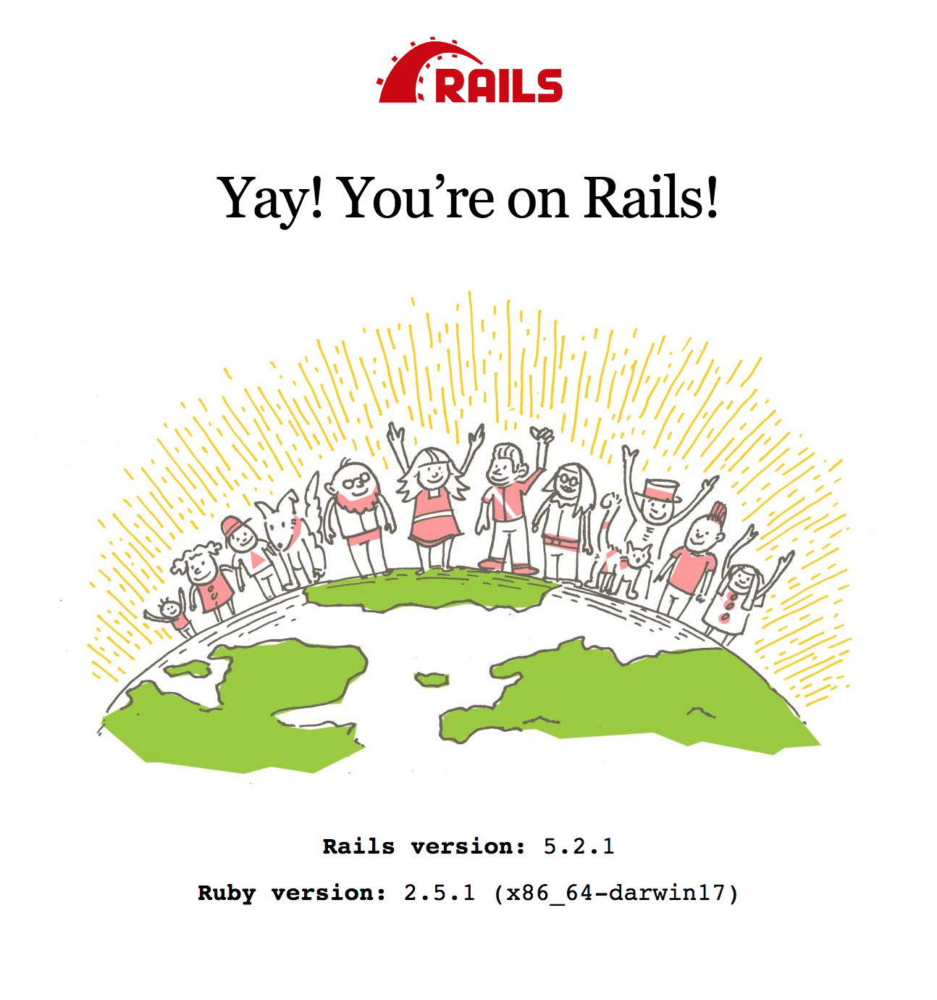

# Install and setup

Let's begin with a haiku.

```
now you know Express
learn Ruby on Rails today
contrast, compare, code
```

Let's get started!

### What is Rails?

According to Wikipedia

> Ruby on Rails, or simply Rails, is a web application framework written in Ruby under MIT License. Rails is a model–view–controller (MVC) framework, providing default structures for a database, a web service, and web pages. It encourages and facilitates the use of web standards such as JSON or XML for data transfer, and HTML, CSS and JavaScript for display and user interfacing. In addition to MVC, Rails emphasizes the use of other well-known software engineering patterns and paradigms, including convention over configuration (CoC), don't repeat yourself (DRY), and the active record pattern.


### Hello, Rails!

We're going to start by setting up a very simple Rails app to say Hello World!

First we need to install Rails.  Once you have rails installed you will not need to run this command for new projects.  You can however run this command to update your version of rails.

```
  $ gem install rails
```
From your work directory run.

```
  $ rails new rails-hello-world
```

cd into rails-hello-world and run.

```
  $ rails s
```

Go to localhost:3000 and you should see.


Awesome, you are riding Ruby on Rails.  Now let's get it to say 'Hello World!'.

In rails-hello-world/config/routes.rb file uncomment out line 6
```  root 'welcome#index'```

Inside rails-hello-world/app/controllers create a new file called welcome_controller.rb.  In that file add the following code:

```
class WelcomeController < ApplicationController

  def index
    render plain: "Hello World"
  end

end

```

Awesome! Your should now see "Hello World" when you visit localhost:3000.  If you don't try restarting your server.
Let's render "Hello World" In a view file.

Add a directory inside the rails-hello-world/app/views folder called welcome.  Inside that add a index.html.erb file.

Add the html,
```
<!DOCTYPE html>
<html>
  <head>
    <meta charset="utf-8">
    <title></title>
  </head>
  <body>
    <h1>Hello World</h1>
  </body>
</html>
```

The controller is still rendering "Hello World", but not the index.html.erb file. Change the code in your welcome_controller.rb to,
```
class WelcomeController < ApplicationController

  def index
  end

end

```

## Questions
* How does rails know to render the index.html.erb file?
* Why is Rails so popular?
* Why is our index file called index.html.erb?
* What is ```root 'welcome#index'``` doing in our routes.rb file?
* What is happening in our welcome_controller.rb file?

## Resources
http://guides.rubyonrails.org/
