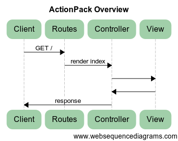
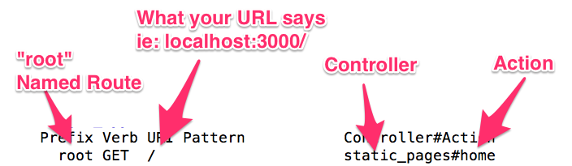
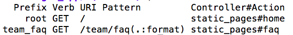
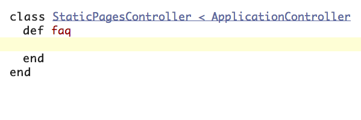
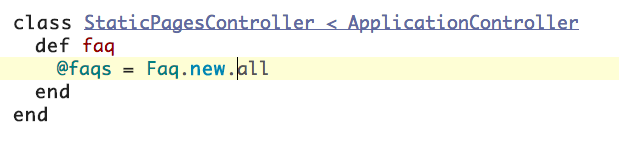
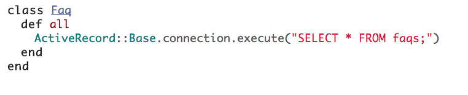
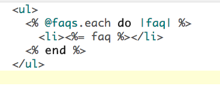

### Rails & MVC

Rails is built with an `MVC` architecture in mind. `MVC` stands for `Model`, `View`, `Controller`. When we build rails apps, we work primarily between files in each of these directories (app/controllers/, app/models/ app/views/). These three areas all have individual conventions, and we should code within those conventions when working on Rails apps.

Watch this [Understanding MVC video](https://www.youtube.com/watch?v=eTdVkgF_Slo) for a visual overview.

### Why MVC?

```
Before model-view-controller frameworks, there was spaghetti.  From jsp,
to PHP to ASP, it seemed like almost every web framework was bound to
end up in spaghetti code, and devolve into a mushy mess.

MVC frameworks came along and brought a structure to the world of web
development. While the conventions in Rails may seem like overkill
in order to create basic web pages, as we go forward it will become
clear why it's important. You will also notice that, while Express doesn't
force these conventions on you, you've been operating in this architecture
in Express all along.
```

## High Level MVC
An MVC pattern dictates how we organize our code and how the HTTP cycle in an application should behave. The pattern in Rails is almost identical to the patterns you've used in Express.



`routes` -> `controller` -> `action` -> `model` -> `view`.

This is the general order of operations you'll follow to build out new pages in Rails.

A spoken sequence may be like this: a request comes in from the browser to our server, we _route_ the request to the `controller`, the `controller` (potentially) requests and receives data from a `model`, the `controller` (potentially) sends the data from the `model` to the `view`, and the `view` returns HTML to the `controller`, which is sent back to the browser.

#### Routes

There's a layer that sits on top of the `MVC` architecture called the `routing` layer. `Routes` in Rails applications (like in Express and most other frameworks) are responsible for directing HTTP requests to a particular **behavior** (which the Controller is responsible for).

In Express, the routes look like this:

```
router.get('/team/people', function(req, res, next) {
  // some behavior code
});
```

This directs an HTTP GET request to some behavior (in this case, a callback function, but it could easily be a named function instead).

In Rails, routes look like this:

```
get "/team/people", to: "static_pages#people"
```

This directs HTTP GET requests for `/team/people` to some behavior ('static_pages#people'). In this case, the behavior isn't defined in the same route file; instead, it is in the `static_pages` controller file and inside of the `people` method.

We'll revisit this shortly.

### Root Route and Rake
Every rails app will have a _root_ route, which will serve up the _home_ page of applications. The root route can look something like this:

`root "static_pages#home"`

The routes file is found at `config/routes.rb`. If we add this to our routes file and run `rake routes` from the console, we'll get an output like this:



Notice the friendly output? Rails gives us clues as to what our routes are expecting and where they are mapping to. I almost _always_ run `rake routes` after adding a route! It is not a bad habit to get in to.

We only have _one_ `root route` per application. All other routes will follow a pattern similar to the first Rails route I showed you above. Here's another example of the typical (non root) route.

`get "/team/faq", to: "static_pages#faq"`

As always, if I run `rake routes`, I'll see that my new `route` is output to the console.



#### Controllers

So, if we were to send an HTTP GET request to the route above (/team/faq), a request to `/team/faq` is sent _from_ the browser _to_ our server. Our routes will then map this request to the `StaticPagesController`. I like to read this as, "Anyone who wants to _get_ the /team/faq page, must talk `to` the faq `action` inside of our `StaticPagesController`".

Our `StaticPagesController` would look something like this, and we would name the file `static_pages_controller.rb` in our `app/controllers/` directory.

```
The `convention` for naming controller files
is to _snake_case_ the `controller's` class
name, with `_controller` appended to the name.
```



Within the `StaticPagesController`, the request we sent to `/team/faq` would talk directly to the faq `action` (Ruby method). That is, this request will only deal with the code in between the `def faq` and its `end`. Right now it is empty, but we'll add to it in a second.

As a general rule, all of the `controller classes` we define will _inherit_ from ApplicationController. That means a lot of things, but for now, just remember the syntax ` < ApplicationController`. This is basically giving our `controller class` some additional methods that exist under the hood. In other words, we're expanding its `behavior` with some help from the Rails framework.

We refer to methods in our `controllers` as `actions`. When a request hits our faq `action`, the code in the `action` will execute. Maybe we have something like this:



Above you can see the instance variable `@faqs` is defined. We'll dive into this syntax and why / how it's used in the next two sections.

#### Models

This piece of code introduces the Faq `class`, which will be the `M` in `MVC`. We would say `Faq.new.all` instantiates a Faq `object`, and calls the `.all` method on it. We would define the Faq `class` with the `.all` method like this. This would be saved as `/apps/models/faq.rb`. The `convention` for naming models is to name the file after the name of the class:



`Models`, like `controllers`, are just Ruby classes with some extra behaviors thanks to Rails. Don't worry about the actual code in the `.all` method, but as you can possibly tell, it is just executing an SQL command. The idea would be that this method fetches all of our FAQ records from the database, and then gives that set of data back to the `controller`, probably in the form of an array.

So, back to our `controller`, we assign the `instance variable` (`@faqs`) to the _result_ of  `Faq.new.all`. This code binds the data from the database to the coresponding view for this controller.

In Express, this is done with the `render` method like so:

```
Faqs.find({}, function(err, docs) {
  res.render('faq', { faqs: docs});
});
```

Notice above how we are passing the view an object with an `faqs` property that has the `docs` value. In Express, that makes the `faqs` property available in the view (you'd likely reference it with Handlebars or Jade like so: `{{faqs}}`).

Instead of passing an object to a `render` method, Rails just asks that we assign an instance variable to some value. This will automatically make that data available in the corresponding view.

#### Views

To make the `view` file for our faq `action` we must create a new `directory` in our `app/views/` directory. This directory is _always_ named the same as the controller we are working with. That way, Rails can just render it by default.

In this case, the directory would be like this: `apps/views/static_pages/`.  A `view` is associated to both a `controller` as well as an `action`. We name the _directory_ after the `controller`, and we name the _file_ itself after the `action`. To come full circle, we would name the `view` for the faq `action` as `/apps/views/static_pages/faq.html.erb`

We submit to this type of file structure, or this `convention`, because it is likely that we will have multiple `view` files that are named the same, such as `index.html.erb`, as our `controllers` tend to follow a convention that frequently defines index `actions`, as well as a few others.

In our `view`, we can write both HTML and `ruby`. To distinguish between what is HTML and what is `ruby`, we use something called `ERB`, or `embedded ruby`. These obnoxious tags `<%= %>` and `<% %>` are the two main `erb tags`. Anything between `erb tags` will be treated, and thus executed, as `ruby`. If you have syntax errors in between `erb tags`, you're page will throw up errors and will not render.

Remember how we had an `instance variable` defined in our `action` back in the `controller` that is an _array_? Let's _iterate_ through that `array` with a `.each` method. In other words, let's just write some `ruby` in our `view` file, and while we are at it, we'll use a little HTML to mark it up properly.



Pretend the `@faqs` `instance variable` is an array of 10 strings, or sentences that represent a FAQ. This piece of code would use Ruby to _loop_ through each string of the `@faqs` array to the page. If our `@faqs` variable consisted of 100 FAQs, we would see 100 items in the browser.

This whole process is the general `Routes` + `MVC` workflow, and it is essential to being effective with the Rails framework.

## Further Reading
* [MVC lesson for Angular](https://github.com/gSchool/angular-curriculum/blob/master/Unit-1/02-angular-mvc.md)
* Read:[MVC Explained with Legos](https://realpython.com/blog/python/the-model-view-controller-mvc-paradigm-summarized-with-legos)
